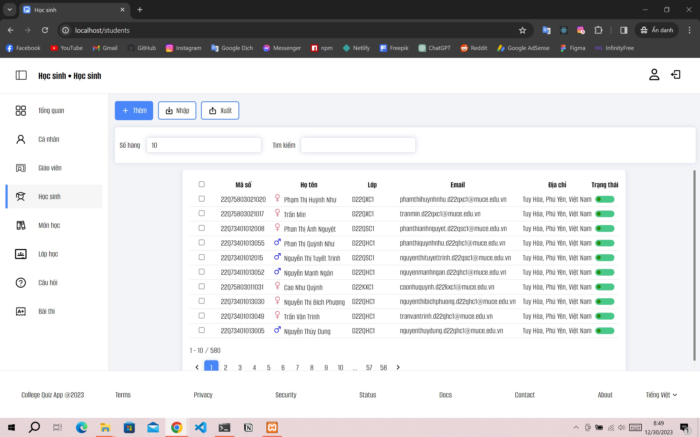
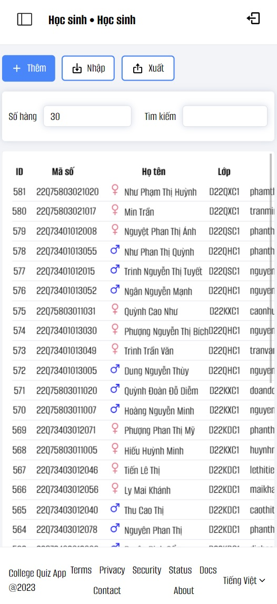

# College-Quiz-App

## Prerequisites

- Nodejs (only for Dev)
- PHP 8.1 or later
- MySQL / MariaDB

## Installation

``` console
git clone https://github.com/HOAIAN2/college-quiz-app.git
```

- Run `prepare.sh` to generate .env file and install libs for server and client.
- Edit Enviroment variables in .env file.

``` env
DB_CONNECTION=mysql
DB_HOST=127.0.0.1
DB_PORT=3306
DB_DATABASE=college-quiz-app
DB_USERNAME=admin
DB_PASSWORD=123456789
````

- Create databse

```console
php artisan migrate
```

- Seed databse (Change root account in databse/seeders/UserSeeder.php)

```console
php artisan db:seed
```

## Demo




