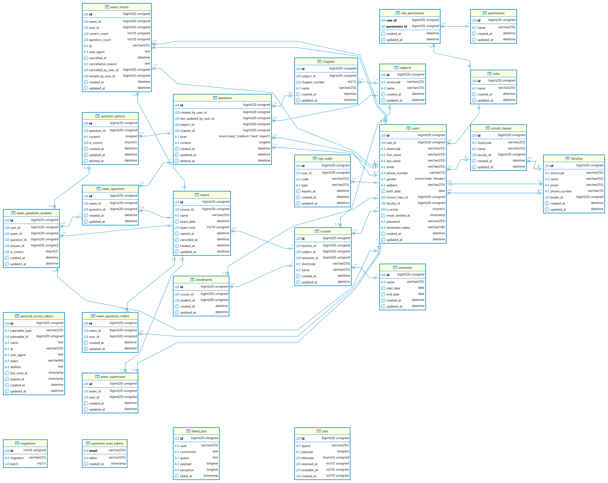

# College-Quiz-App

## Technologies

- Laravel 11
- React 18

## Prerequisites

- Nodejs (only for Dev)
- PHP 8.2 or later
- MySQL / MariaDB

## Installation

``` console
git clone https://github.com/HOAIAN2/college-quiz-app.git
```

- Run `install.sh` to generate .env file and install libs for both server and client.
- Edit Enviroment variables in .env file.

``` env
DB_CONNECTION=mariadb
DB_HOST=127.0.0.1
DB_PORT=3306
DB_DATABASE=college-quiz-app
DB_USERNAME=admin
DB_PASSWORD=123456789
````

- Remember to update your correct timezone

``` env
APP_TIMEZONE=UTC
```

- Create databse, seed data

```console
php artisan migrate
```

```console
php artisan db:seed
```

- Seed databse (Change root account in databse/seeders/UserSeeder.php)

- Build

Some free hosting like infinityfree, 000webhost only allow GET, POST method so you can config override method when call api on client

``` env
VITE_DEV_PORT=3000
VITE_DEV_SERVER_PORT=8000
VITE_OVERRIDE_HTTP_METHOD=true
```

## Editor settings

This project combine both frontend and backend, maybe it some extensions not correctly. Here is my vscode settings for this project:

```json
{
 "LaravelExtraIntellisense.basePath": "./backend",
 "LaravelExtraIntellisense.basePathForCode": "./backend",
 "laravel_goto_view.folders": {
  "default": "/backend/resources/views",
  "js": "/backend/resources/js/Pages",
  "vendor": "/backend/resources/views/vendor"
 },
 "typescript.tsdk": "./frontend/node_modules/typescript/lib",
}
```

## Deploy

### Free hosting

Run Deploy file to build and compress all necessary files to app.tar.gz

```console
./deploy.sh
```

Run `composer install` to continue development or just use this everytime.

```console
./build && ./deploy.sh && composer install
```

You can host front end and backend in 2 domain

```env
VITE_API_HOST=
```

### VPS with Docker

You can host this with `docker` by run simple command

```console
sudo docker composer up
```

Docker settings save in `docker` directory, `Nginx` connect to `php-fpm` via unix socket instead of normal TCP socket. You can custom `php-fpm` settings by modify the `zz-docker.conf`, but you have to create the file first by copy content from `zz-docker.example.conf`

I'm only setup `Nginx` with `php-fpm` so you have to host your database, cache server like redis yourself, just modify the `docker-compose.yml` or using any other way to host you database.

## Cron Job

Free hostings do not allow run cron job so I setup cron job inside a middlware in bootstrap/app.php. But you can also setup "real" cron job: <https://laravel.com/docs/scheduling>

```php
$middleware->group('api', [
   \Laravel\Sanctum\Http\Middleware\EnsureFrontendRequestsAreStateful::class,
   'throttle:api',
   \Illuminate\Routing\Middleware\SubstituteBindings::class,
   \App\Http\Middleware\CamelCaseResponse::class,
   \App\Http\Middleware\RunTasks::class,
   // \App\Http\Middleware\Authenticate::class,
   // \App\Http\Middleware\AcceptContentType::class,
  ]);
```

## Backup database

Use any tool or just cli like this (I'm using marriadb)

```console
mariadb-dump --user=[YOUR_USERNAME] --password=[YOUR_PASSWORD] [DATABASE_NAME]--host=<127.0.0.1> --port=<PORT> -r backup.sql
```

## Databse Diagram



## Demo

### Dashboard UI


### Students UI


### Course UI


### Exams UI


### Exam UI


### Take Exam UI


### Exam Result UI


Full review (Vietnamese) at Youtube: <https://www.youtube.com/watch?v=Xkss5f4N0vw>
